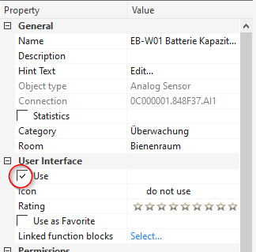

# ioBroker adapter for Loxone Miniserver

Fetches all information available in Loxone Miniserver (and Loxone Miniserver Go) and provides changes in realtime.

## Install

Install this adapter via ioBroker Admin:
1. Open instance config dialog
2. Enter the IP address or host name and HTTP port (80 by default) of your Loxone Miniserver
3. Create a new user in the Loxone Miniserver (using the Loxone Config application) to which you only give read rights to all required variables.
4. Enter this user's name and its password in the config dialog
5. Save the configuration
6. Start the adapter

## Configuration

### Miniserver Hostname / IP

This is the IP address or host name of your Loxone Miniserver or Miniserver Go.

### Miniserver Port

This is the HTTP port of your Loxone Miniserver.
By default the Miniserver is configured to listen on port 80, but you might have changed it.

### Miniserver Username

Provide a valid username to access the Loxone Miniserver.
It is strongly suggested to use a user different from "admin" for security reasons.
The user only needs read access to the variables you want to use from ioBroker.

### Miniserver Password

Provide the password for the given username (see above).
Please be aware that this password is stored unsecured inside ioBroker - therefore don't use the "admin" user!

## States

The adapter automatically connects to the configured Loxone Miniserver and creates states for each control state it finds.
The names of the states are formatted like this: loxone.&lt;instance&gt;.&lt;control&gt;.&lt;state&gt;
- &lt;instance&gt; is the ioBroker adapter instance index (usually "0")
- &lt;control&gt; is the name you gave to the control when configuring it in Loxone Config (non-characters are replaced by underscores "_")
- &lt;state&gt; is the state within the control.
For more information about controls and their states, please have a look at the Loxone API (especially the Structure File): https://www.loxone.com/enen/kb/api/

## Control Visibility

By default Loxone Miniserver hides many controls (and thus their states) from the Web interface.
That means, they are also hidden from this ioBroker adapter.
To ensure, all your states are properly reported to ioBroker, please verify that they have "Use in Visualization" checked:

## Supported Control Types

The following control types are currently supported by this adapter.

### InfoOnlyDigital

Provided by virtual states as well as the Loxone Touch switch.
The boolean state (true / false) of the control is reported in loxone.&lt;instance&gt;.&lt;control&gt;.active.
If configured, the text equivalent of the state is reported in loxone.&lt;instance&gt;.&lt;control&gt;.active-text.
If configured, the image equivalent of the state is reported in loxone.&lt;instance&gt;.&lt;control&gt;.active-image.
If configured, the color equivalent of the state is reported in loxone.&lt;instance&gt;.&lt;control&gt;.active-color.

### InfoOnlyAnalog

Provided by virtual states as well as the Loxone Touch switch.
The state value (number) of the control is reported in loxone.&lt;instance&gt;.&lt;control&gt;.value.
If configured, the formatted value of the state (using the "Unit" format from Loxone Config) is reported in loxone.&lt;instance&gt;.&lt;control&gt;.value-formatted.

## Compatibility

Compatibility has been tested with Loxone Miniserver Go using Loxone Config 8.1.

## Bug Reports and Feature Requests

Please use the GitHub repository to report any bugs or request new features.
If you require a missing control type, please provide the name as it is reported in the error log of ioBroker as well as the entire raw contents of the device in the ioBroker object tree:

Log file example for "LightController":

Native value from ioBroker &gt; Objects

## Legal

This project is not affiliated directly or indirectly with the company Loxone Electronics GmbH.
Loxone and Miniserver are registered trademarks of Loxone Electronics GmbH.